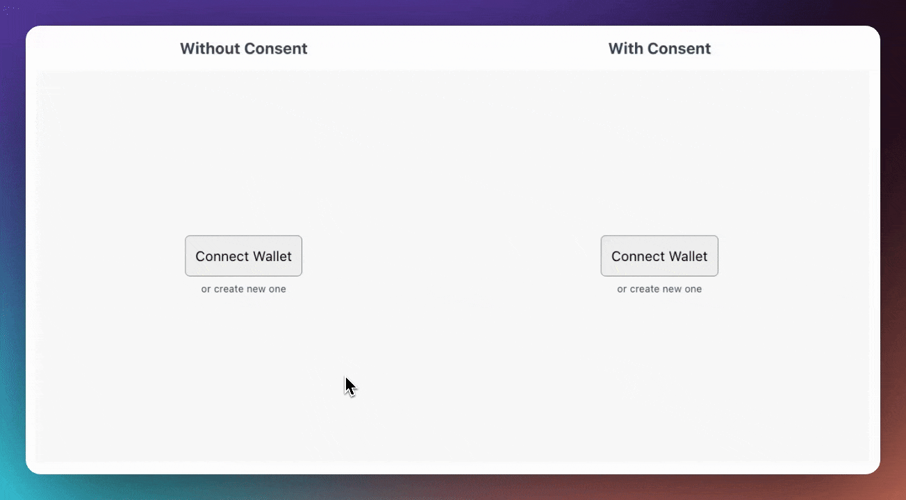

# How to Add Consent to an Existing XMTP App

Managing user consent is essential for enhancing privacy and user experience. If you already have an XMTP application, integrating portable consent features becomes crucial. This guide walks you through adding the consent logic to your existing XMTP app.

## Considerations

Before diving into the code let's consider important aspects while integrating consent features. For example, before making an allow or block action you should synchronize the updated consent list in order to **prevent overwriting network** consent from another app. For more details head to these sections of our docs:

- [Understand user consent preferences](https://xmtp.org/docs/build/user-consent#understand-user-consent-preferences): This section provides a comprehensive understanding of how user consent preferences are set, including but not limited to, direct actions within the app, settings adjustments, and responses to prompts.
- [Use consent preferences to respect user intent](https://xmtp.org/docs/build/user-consent#use-consent-preferences-to-respect-user-intent): Your app should aim to handle consent preferences appropriately because they are an expression of user intent.
- [Synchronize user consent preferences](https://xmtp.org/docs/build/user-consent#synchronize-user-consent-preferences):All apps that use the user consent feature must adhere to the logic described in this section to keep the consent list on the network synchronized with local app user consent preferences, and vice versa.

## Tutorial

- [Initialize XMTP Client with Consent](https://junk-range-possible-git-portableconsenttutorials-xmtp-labs.vercel.app/docs/tutorials/portable-consent/request-inbox#tutorial)

- [Filtering conversations based on consent](https://junk-range-possible-git-portableconsenttutorials-xmtp-labs.vercel.app/docs/tutorials/portable-consent/request-inbox#tutorial)

- [Request inbox](https://junk-range-possible-git-portableconsenttutorials-xmtp-labs.vercel.app/docs/tutorials/portable-consent/request-inbox#tutorial)

- [Refresh consent when opening a conversation](https://junk-range-possible-git-portableconsenttutorials-xmtp-labs.vercel.app/docs/tutorials/portable-consent/request-inbox#tutorial)

- [Allow and denied actions](https://junk-range-possible-git-portableconsenttutorials-xmtp-labs.vercel.app/docs/tutorials/portable-consent/request-inbox#tutorial)

- [Updating consent on message send](https://junk-range-possible-git-portableconsenttutorials-xmtp-labs.vercel.app/docs/tutorials/portable-consent/request-inbox#tutorial)

## Caution :warning:

**Always synchronize consent states:** Before updating consent preferences on the network, ensure you refresh the consent list with `refreshConsentList`. Update the network's consent list only in these scenarios:

- **User Denies Contact:** Set to `denied` if a user blocks or unsubscribes.
- **User Allows Contact:** Set to `allowed` if a user subscribes or enables notifications.
- **Legacy Preferences:** Align the network with any existing local preferences.
- **User Response:** Set to `allowed` if the user has engaged in conversation.

Neglecting these guidelines can result in consent state conflicts and compromise user privacy.

## Conclusion

Consent has really evolved through the years. It started with email, then email marketing, and was the wild west until laws like GPDR stepped in. This is new chapter in the history of consent in a new era for privacy, portability, and ownership.
